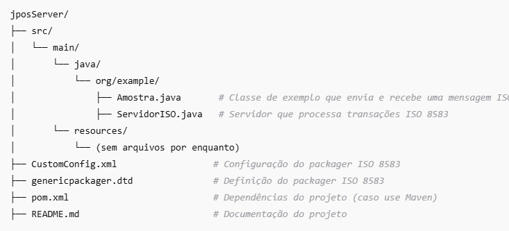

# 🌐 Servidor ISO 8583 com JPos 🌐

Este projeto implementa um **Servidor ISO 8583** utilizando **JPos**, permitindo o processamento e a resposta de transações financeiras no padrão **ISO 8583**. O sistema inclui:

- Um **servidor** ISO 8583 que processa e responde transações.

- Comunicação via **sockets TCP/IP**, gerenciada automaticamente pelo JPos.

- O servidor envia e recebe mensagens formatadas de acordo com o padrão ISO 8583.

---
## 🚀 Tecnologias Utilizadas

- **Java 8+.**

- **JPos.**

- **Sockets TCP/IP** (gerenciados pelo JPos via ASCIIChannel)
- **Maven**: Gerenciador de dependências.

As dependências estão definidas no arquivo pom.xml para facilitar o processo de construção e configuração do projeto.

---
## 🛠️ Estrutura do Projeto
A estrutura do projeto é a seguinte:

---
## ✅ Rodando
1. Clone o repositório:
   ➡️https://github.com/marlosfellipe/jposServer.git

2. Instale as dependências.

3. Veifique se o arquivo **CustomConfig.xml** está correto, pois ele é necessários para o processo ISO 8583

4. Rodar o servidor: Inicie o servidor da classe ServidorISO.java. O servidor ficará aguardando conexões na porta configurada no arquivo de configuração.

5. Consultar mensagem: Após realizar a subida do servidor, rode a classe Amostra.java. A classe **Amostra** envia e recebe uma mensagem ISO 8583 de um servidor usando **JPos**, configurando o pacote de mensagens, enviando para o servidor e recebendo a resposta. A classe se comunica com o servidor via **ASCIIChannel**, que é um canal TCP/IP para enviar e receber mensagens no formato ISO 8583.

## 💬 Como funciona

O servidor é iniciado na porta 5000, utilizando um ASCIIChannel para comunicação.

O servidor ouve requisições e processa mensagens no formato ISO 8583. A cada requisição, ele verifica os dados recebidos e envia uma resposta conforme o protocolo ISO 8583.
---
## 📖 Referências
A elaboração desse projeto foi baseado nas seguintes fontes de estudo.

- **Guia do programador JPos (Traduzido em PT-BR)**: https://drive.google.com/file/d/1Tn-WIm_2aInCKMDkhyqGxwBq-qhxuIx8/view?usp=sharing

- **Guia do programador JPos (Original em Inglês)**: https://drive.google.com/file/d/1uJfDiuerCvBh0lo4-rP3ziDNq1WEWMu3/view?usp=sharing

- **Documentação JPos**: https://jpos.org/doc/javadoc/index.html

- **No GitHub JPos**: https://github.com/jpos/jPOS/tree/tail

- **Medium**: https://medium.com/@lalankeba/create-simple-iso-8583-messages-using-jpos-fe5b47ea4d28
  https://medium.com/@nicklimvs/jpos-how-to-initiate-message-from-qserver-faa960c1d1cd

- **Youtube**: https://www.youtube.com/watch?v=gnmwm2heBOQ&list=PL9buZkTKhIT4RgGV20yE3LSbscMimkgrX&index=1

- **Consutrução do CustomConfig.xml**: https://github.com/jpos/jPOS/tree/tail/jpos/src/main/resources/packager

- **IAs**
___
## 🛠️ TODO(s):
1. Criar uma interface visual simulando um terminal, usando java swing.
2. Implementação de criptografia para segurança (PIN Blocks, MACs).
3. Criar uma interface visual simulando um terminal.
___

## 🤷🏻‍♂️ **Autor:** ***Marlos Fellipe***

